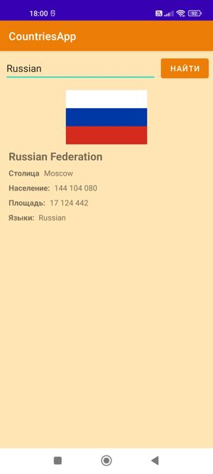
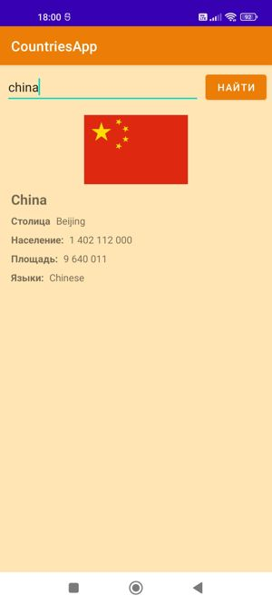
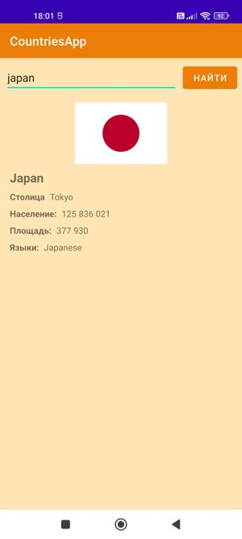
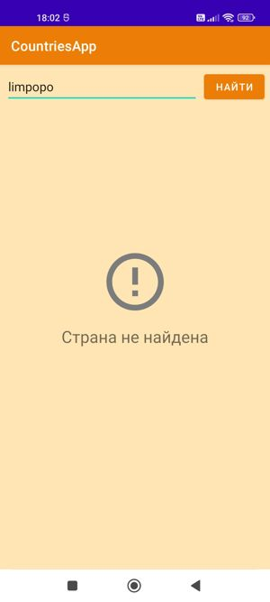
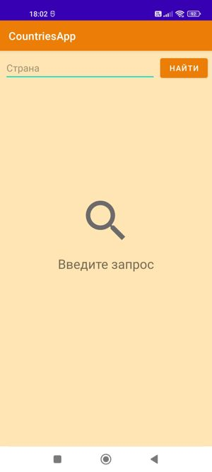

# Countries App

В приложении можно найти информацию о странах

Используя Rest api, и библиотеку для работы с сетью Retrofit получаем данные с сервера в формате Json.
converter-gson - автоматически конвертируем данные Json в удобный для нас формат который мы описали в Kotlin.
Подключаем coroutines коррутин для создания фонового потока, что-бы основной поток не завис.
И используем coil библиотеку для загрузки картинок в формате svg.

